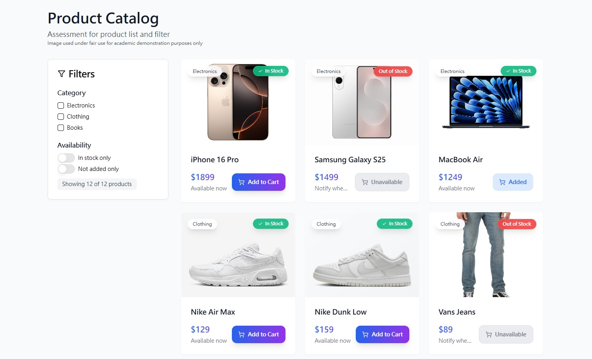
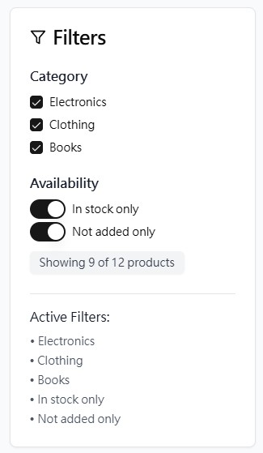
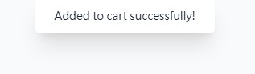
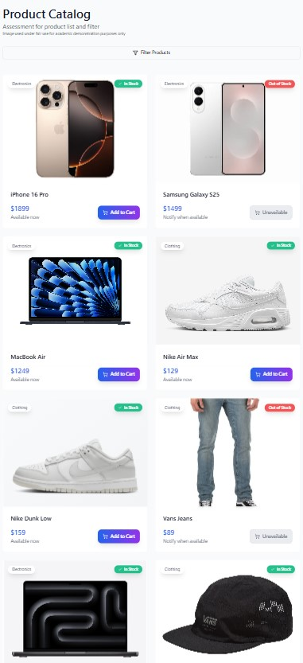
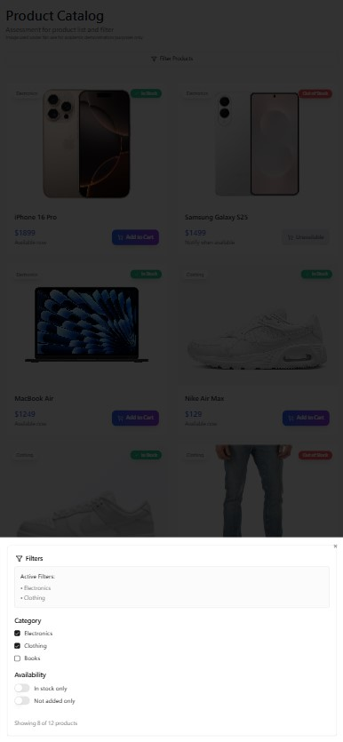

# 🛍️ Product Catalog Demo

A modern, responsive product catalog web application built with **React**, **Tailwind CSS**, and **TypeScript**.  
This project was created for academic purposes to demonstrate filtering, responsive design, animation, and component reuse.

    

---

## ✨ Features

- ✅ Product category filter
- ✅ In-stock toggle filter
- ✅ "Not added only" filter
- ✅ Add to cart animation dialog
- ✅ Responsive grid layout
- ✅ Tooltip, badge, card UI components
- ✅ Error page redirection (404-style)
- ✅ Clean code structure using component composition

---

## 🛠️ Technologies Used

| Tech                     | Purpose                                |
| ------------------------ | -------------------------------------- |
| **React + Vite**         | Web application framework              |
| **TypeScript**           | Type safety                            |
| **Tailwind CSS**         | Utility-first CSS styling              |
| **shadcn/ui**            | Reusable UI components                 |
| **React Router DOM**     | Client-side routing                    |
| **TanStack React Query** | Data fetching and caching (extensible) |
| **Lucide React**         | Icons                                  |
| **Radix UI**             | Accessible tooltip & switch            |

---

## 📦 Installation & Run

```bash
# Clone the project
git clone https://github.com/uynot/product-page-assessment-app.git

# Enter the directory
cd product-page-assessment-app

# Install dependencies
npm install

# Start development server
npm run dev
```
